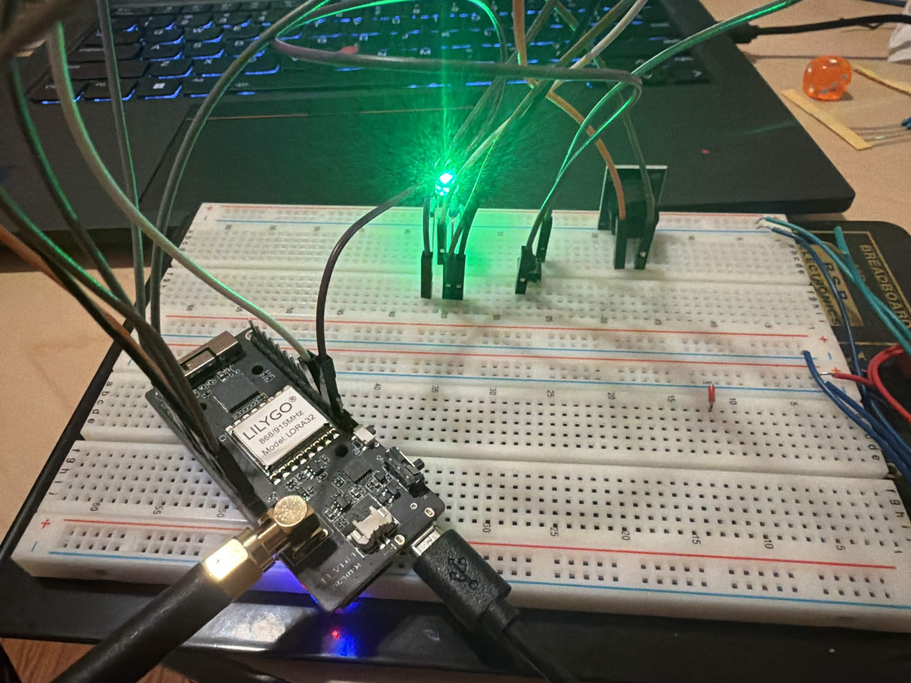
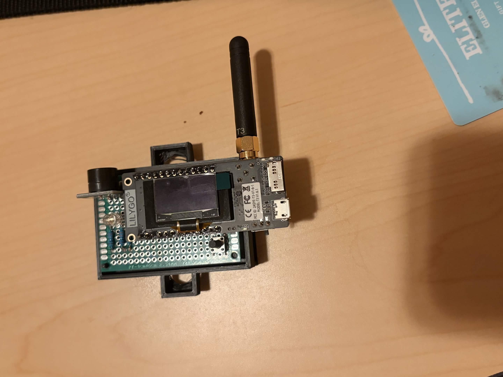
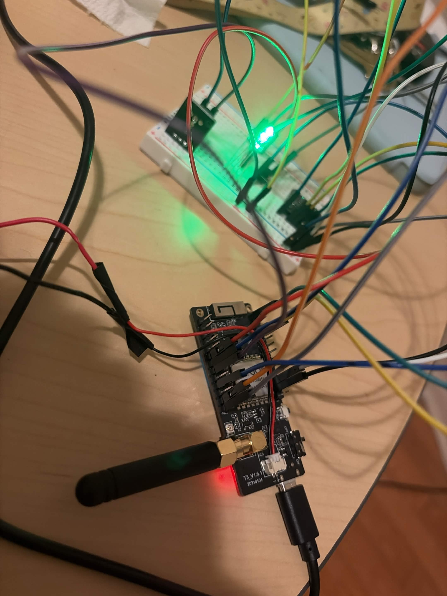
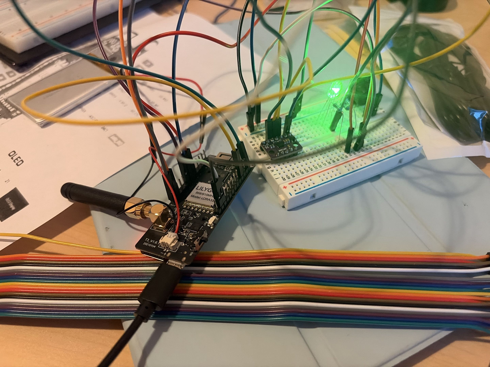
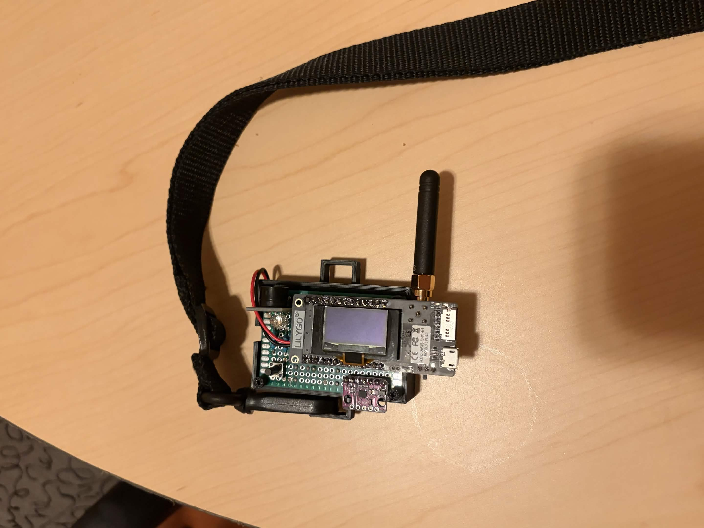

# Hardware Evidence

Photographs documenting the physical build of the ARMOR prototype.

---

## Receiver board

| File | Description |
|------|-------------|
|  | Receiver (LILYGO T3 V1.6.1) assembled on breadboard during initial build and functional test — RGB LED, KY-006 buzzer, acknowledge button, and LoRa antenna |
|  | Close-up of the finished receiver board showing component placement and wiring |

---

## Sender board

| File | Description |
|------|-------------|
|  | Sender (LILYGO T3 V1.6.1 + DFRobot Gravity BMI160) assembled on breadboard — IMU, RGB LED, KY-006 buzzer, cancel button, and LiPo battery connector |
|  | Sender breadboard build from a second angle — showing BMI160 I²C wiring and power connections |
|  | Close-up of the finished sender (wearable) board showing the full assembly |

---

## Related documentation

- [`docs/hardware-wiring.md`](../../docs/hardware-wiring.md) — GPIO pin assignments and breadboard wiring for both boards
- [`hardware/README.md`](../../hardware/README.md) — Bill of materials for the v1 prototype
