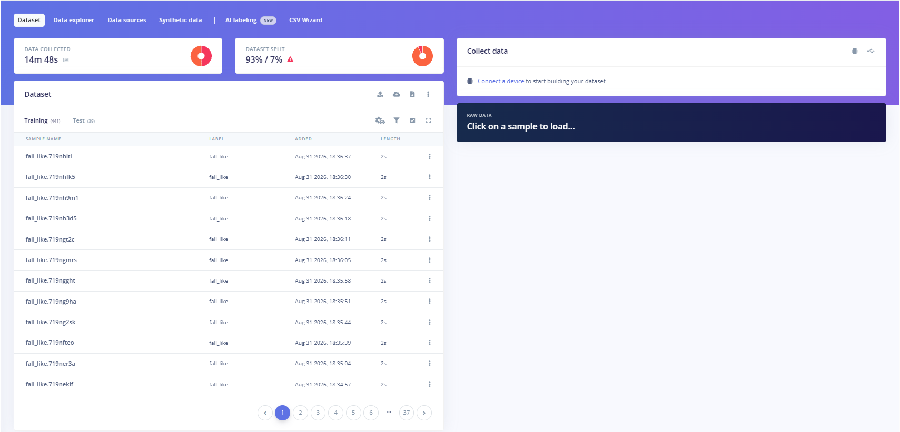
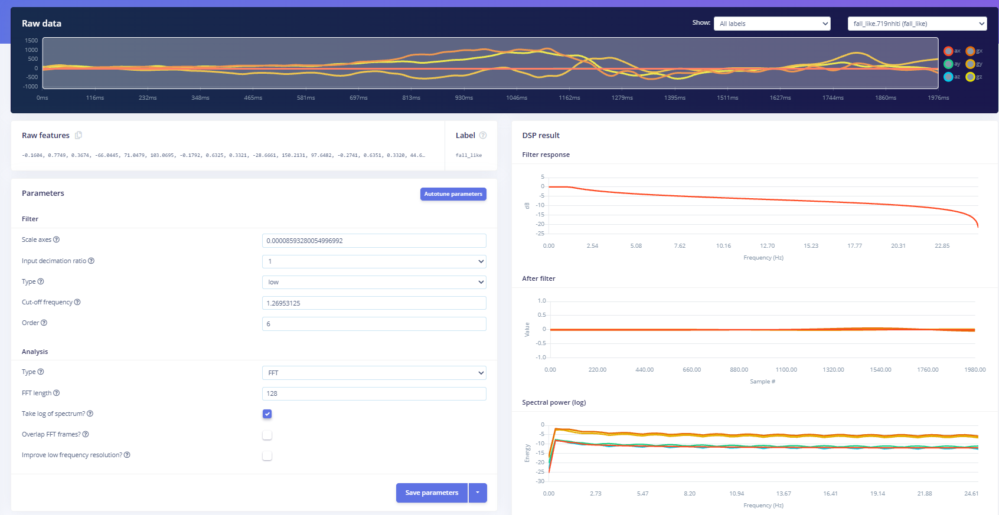
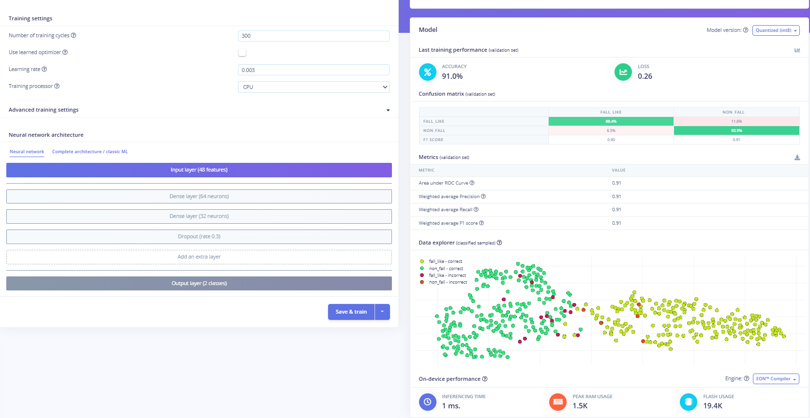

# ML Training Evidence

Edge Impulse screenshots documenting all six training attempts for the ARMOR
fall-detection binary classifier (`fall_like` vs `non_fall`).

For the full written record of each attempt — architecture, accuracy, AUC, and
decisions made — see [`docs/testing-validation.md`](../../docs/testing-validation.md).

---

## Attempt 1 — Initial dataset, 3 classes

- **Classes:** `normal`, `fast_motion`, `fall_like`
- **Architecture:** Dense 20 → 10
- **Accuracy:** 30.0% — model collapsed to `normal`; dataset too small

---

## Attempt 2 — More data added, 3 classes

- **Classes:** `normal`, `fast_motion`, `fall_like`
- **Architecture:** Dense 20 → 10
- **Accuracy:** 66.67% | AUC: 0.83 — large improvement; cross-class confusion remained

---

## Attempt 3 — Further data, 3 classes

- **Classes:** `normal`, `fast_motion`, `fall_like`
- **Architecture:** Dense 20 → 10
- **Accuracy:** 67.9% | AUC: 0.82 — accuracy plateaued; three-class boundary unstable

---

## Attempt 4 — Merged to 2 classes

- **Classes:** `non_fall` (merged), `fall_like`
- **Architecture:** Dense 20 → 10
- **Accuracy:** 90.3% | AUC: 0.88 — large jump after class merge; on-device false positives during sitting

---

## Attempt 5 — Re-collected sitting data, 2 classes

- **Classes:** `non_fall`, `fall_like`
- **Architecture:** Dense 20 → 10
- **Accuracy:** 92.31% | AUC: 0.88 — sitting false positives resolved

---

## Attempt 6 — Expanded architecture (final deployed model)

- **Classes:** `non_fall`, `fall_like`
- **Architecture:** Dense 64 → Dense 32 → Dropout 0.3
- **Accuracy:** 91.0% | AUC: 0.91
- `fall_like` recall improved from 79% → **88.4%**
- **This is the model deployed to the sender firmware**

---

## Final model configuration — Edge Impulse project screenshots

These four screenshots document the exact configuration of the final deployed
model (Attempt 6) inside Edge Impulse Studio.

---

### Dataset

The Edge Impulse **Dataset** page showing the complete final dataset used for
Attempt 6 training.

- **Total data collected:** 14 minutes 48 seconds of IMU recordings
- **Dataset split:** 93% training (441 samples) / 7% test (39 samples)
- **Labels:** `fall_like` and `non_fall` (two-class binary classifier)
- Each sample is a 2-second window captured at 50 Hz from the BMI160 6-axis IMU
- Sample names follow the Edge Impulse auto-generated convention
  (e.g. `fall_like.719nhlti`) — the prefix indicates the label, the suffix is a
  unique session ID
- The 93/7 split reflects the relatively small dataset size; the 7% test set
  (39 samples) was held out and not seen during training

---

### Impulse design

The Edge Impulse **Impulse** page showing the full signal-processing and
learning pipeline for Impulse #1.

- **Input block — Time series data:**
  - 6 input axes: `ax`, `ay`, `az` (accelerometer) and `gx`, `gy`, `gz` (gyroscope)
  - Window size: **2,000 ms** — captures the full duration of a fall event
  - Window stride: **500 ms** — how far the window advances between inferences;
    matches the 500 ms inference interval in the sender firmware
  - Sampling frequency: **50 Hz** — matches the BMI160 collection rate
  - Zero-pad data enabled — short samples at the edge of a recording are
    zero-padded rather than discarded
- **Processing block — Spectral Analysis:**
  - Extracts frequency-domain features from all 6 axes using FFT
  - Spectral features fed into the classifier
- **Learning block — Classification:**
  - Neural network classifier consuming the spectral features
  - Output: 2 classes — `fall_like`, `non_fall`

---

### Spectral features (DSP parameters)

The Edge Impulse **Spectral Features** page showing the DSP (digital signal
processing) parameters applied to each 2-second IMU window before it is passed
to the neural network.

- **Raw data plot (top):** A `fall_like` sample (`fall_like.719nhlti`) displayed
  across all 6 axes over the 2,000 ms window — the coloured lines are ax/ay/az
  (warm colours) and gx/gy/gz (cool colours); the large spike and orientation
  shift are characteristic of a fall impact
- **Filter settings (autotuned):**
  - Type: **low-pass**, order 6
  - Cut-off frequency: **1.27 Hz** — aggressively removes high-frequency noise
    above the fall-signal band; value was autotuned by Edge Impulse
  - Scale axes: `0.0000859…` — normalises raw IMU counts to consistent range
  - Input decimation ratio: 1 (no downsampling)
- **Analysis settings:**
  - Type: **FFT**, length **128 points**
  - Log of spectrum enabled — compresses dynamic range for the neural network
  - Overlap FFT frames and improve low-frequency resolution both disabled
- **DSP result plots (right):**
  - *Filter response:* shows the low-pass roll-off beginning around 1.27 Hz,
    reaching −25 dB by 23 Hz
  - *After filter:* the filtered time-domain signal is nearly flat — most
    motion energy is in the very low-frequency band
  - *Spectral power (log):* all 6 axes concentrated in the 0–5 Hz range, which
    is where fall and movement signatures live

---

### Classifier settings and final results

The Edge Impulse **Classifier** page showing the neural network architecture,
training settings, and final validation performance for Attempt 6 — the
deployed model.

**Training settings:**
- Training cycles: **300**
- Learning rate: **0.003**
- Learned optimizer: off (standard Adam)
- Training processor: CPU

**Neural network architecture:**
- Input layer: **48 features** (spectral features from 6 axes × FFT bins)
- Dense layer: **64 neurons**
- Dense layer: **32 neurons**
- Dropout: **rate 0.3** — regularisation to reduce overfitting
- Output layer: **2 classes** (`fall_like`, `non_fall`)

**Validation performance:**
- Accuracy: **91.0%** | Loss: **0.26**
- Confusion matrix:
  - `fall_like` correctly classified: **88.4%** (11.6% missed)
  - `non_fall` correctly classified: **93.5%** (6.5% false positives)
  - F1 scores: `fall_like` **0.90**, `non_fall` **0.91**
- AUC, Precision, Recall, F1 (weighted): all **0.91**

**On-device performance (EON Compiler, quantized int8):**
- Inferencing time: **1 ms**
- Peak RAM usage: **1.5 KB**
- Flash usage: **19.4 KB**

The data explorer scatter plot (bottom right) shows the two-class separation —
green/yellow-green clusters are correctly classified samples; red dots are
misclassified samples. The two classes form broadly separate clusters with some
overlap at the boundary, which is expected given the similar low-frequency IMU
profiles of certain non-fall movements (e.g. fast sits) and slow falls.

---

## Related documentation

- [`docs/testing-validation.md`](../../docs/testing-validation.md) — Full training history, confusion matrices, and validation metrics
- [`ml/README.md`](../../ml/README.md) — Model summary and Arduino library install instructions
