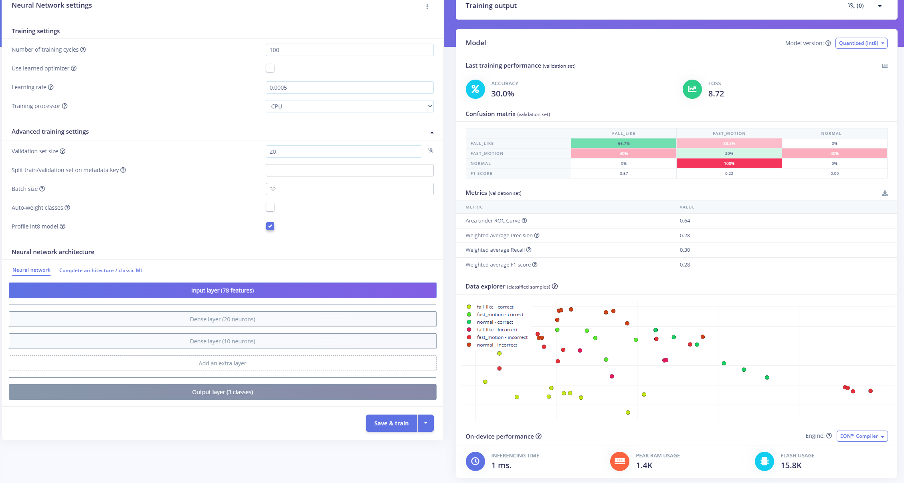
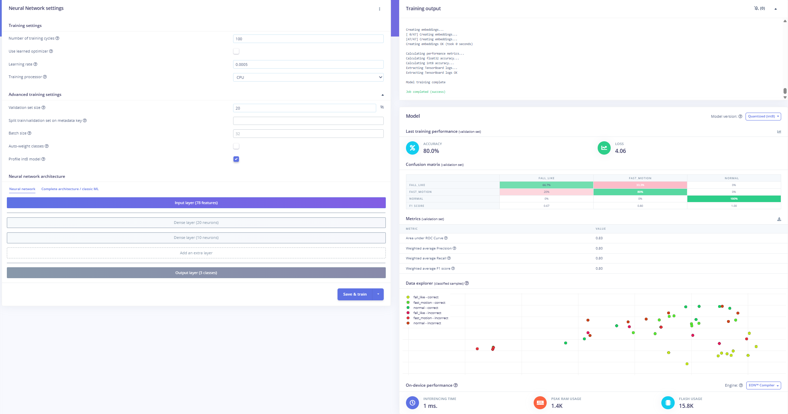
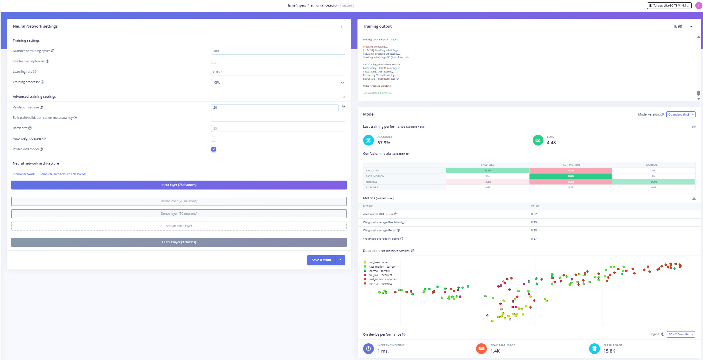
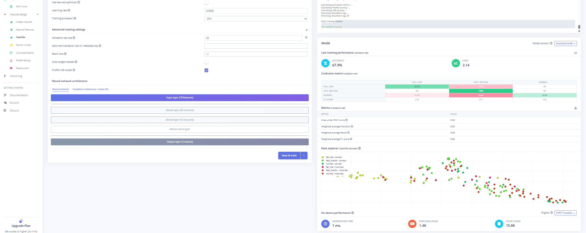
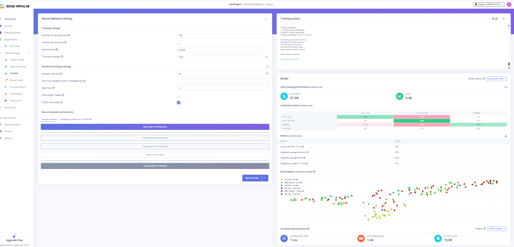
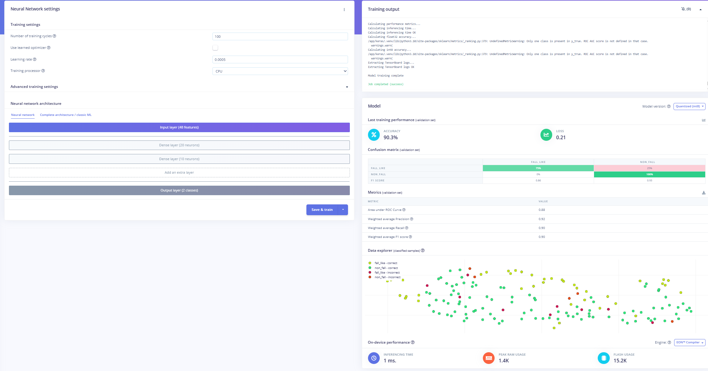

# ML Training Evidence

Edge Impulse screenshots documenting all six training attempts for the ARMOR
fall-detection binary classifier (`fall_like` vs `non_fall`).

For the full written record of each attempt — architecture, accuracy, AUC, and
decisions made — see [`docs/testing-validation.md`](../../docs/testing-validation.md).

---

## Attempt 1 — Initial dataset, 3 classes

- **Classes:** `normal`, `fast_motion`, `fall_like`
- **Architecture:** Dense 20 → 10
- **Accuracy:** 30.0% — model collapsed to `normal`; dataset too small

---

## Attempt 2 — More data added, 3 classes

- **Classes:** `normal`, `fast_motion`, `fall_like`
- **Architecture:** Dense 20 → 10
- **Accuracy:** 66.67% | AUC: 0.83 — large improvement; cross-class confusion remained

---

## Attempt 3 — Further data, 3 classes

- **Classes:** `normal`, `fast_motion`, `fall_like`
- **Architecture:** Dense 20 → 10
- **Accuracy:** 67.9% | AUC: 0.82 — accuracy plateaued; three-class boundary unstable

---

## Attempt 4 — Merged to 2 classes

- **Classes:** `non_fall` (merged), `fall_like`
- **Architecture:** Dense 20 → 10
- **Accuracy:** 90.3% | AUC: 0.88 — large jump after class merge; on-device false positives during sitting

---

## Attempt 5 — Re-collected sitting data, 2 classes

- **Classes:** `non_fall`, `fall_like`
- **Architecture:** Dense 20 → 10
- **Accuracy:** 92.31% | AUC: 0.88 — sitting false positives resolved

---

## Attempt 6 — Expanded architecture (final deployed model)

- **Classes:** `non_fall`, `fall_like`
- **Architecture:** Dense 64 → Dense 32 → Dropout 0.3
- **Accuracy:** 91.0% | AUC: 0.91
- `fall_like` recall improved from 79% → **88.4%**
- **This is the model deployed to the sender firmware**

---

## Related documentation

- [`docs/testing-validation.md`](../../docs/testing-validation.md) — Full training history, confusion matrices, and validation metrics
- [`ml/README.md`](../../ml/README.md) — Model summary and Arduino library install instructions
