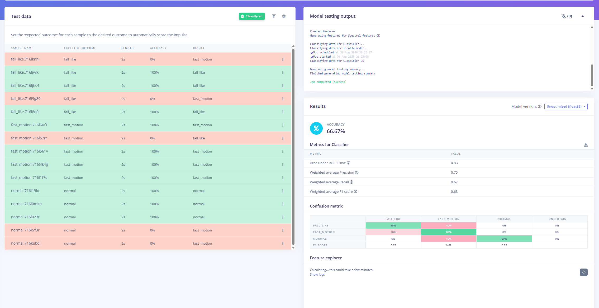
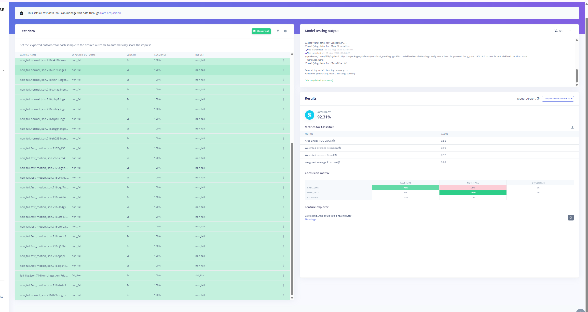

# On-Device Validation Evidence

Screenshots from physical on-device testing of the ARMOR prototype.

---

## First model validation — Attempt 1 result

Result of deploying the first trained model to the sender hardware. This test
exposed early false-positive and missed-detection issues that drove subsequent
data collection and retraining.

---

## Final model validation — Attempt 6 result

Result of deploying the final Attempt 6 model (Dense 64 → 32 → Dropout 0.3).
All five fall types detected. False positives during sitting resolved. Full
end-to-end LoRa transmission to the receiver validated.

---

## What was validated on-device

| Test | Result |
|------|--------|
| Fall detection — all 5 fall types | ✓ Validated |
| False positives during sitting still | ✓ Resolved after Attempt 5 re-collection |
| False positives during sitting up and down | ✓ Resolved after Attempt 5 re-collection |
| Cancel-button suppression (5-second countdown) | ✓ Validated |
| LoRa transmission and packet receipt | ✓ Validated (sender → receiver) |
| OLED display and alert sequence | ✓ Validated |
| Battery monitoring accuracy | ✓ Validated against multimeter reading |

---

## Related documentation

- [`docs/testing-validation.md`](../../docs/testing-validation.md) — Full validation write-up and confusion matrices
- [`evidence/ml-training/`](../ml-training/) — Training screenshots for all six attempts
